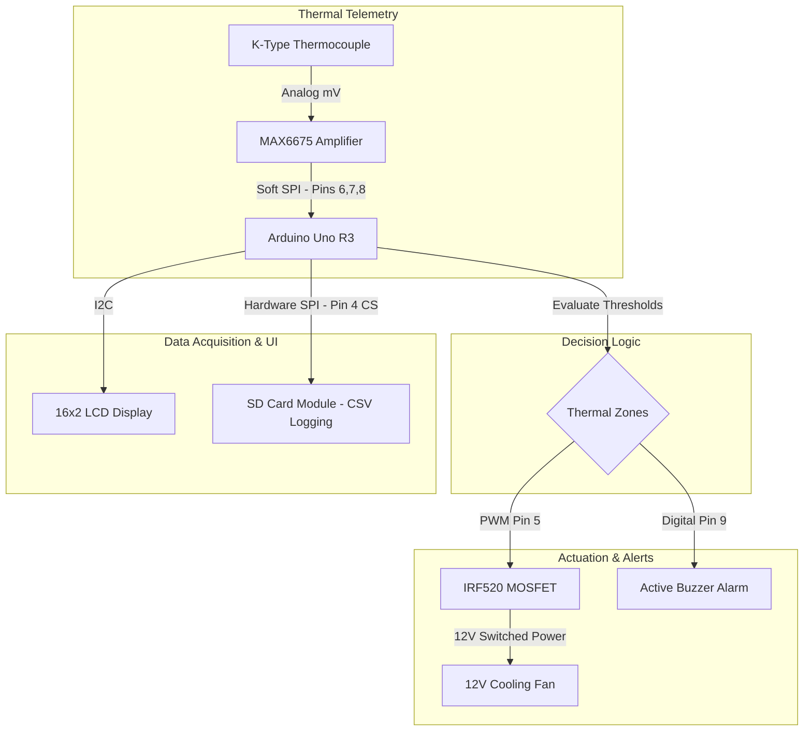
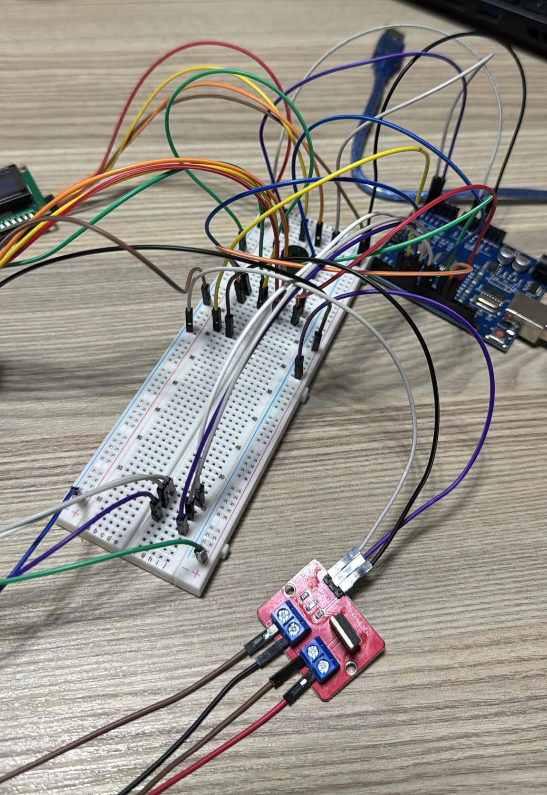
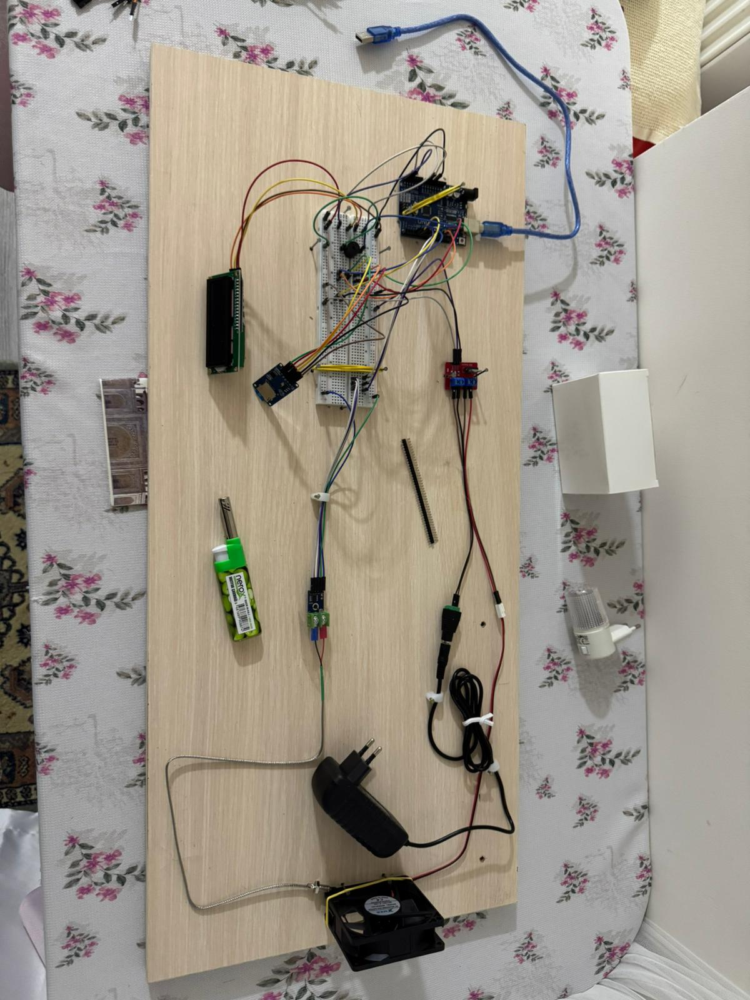
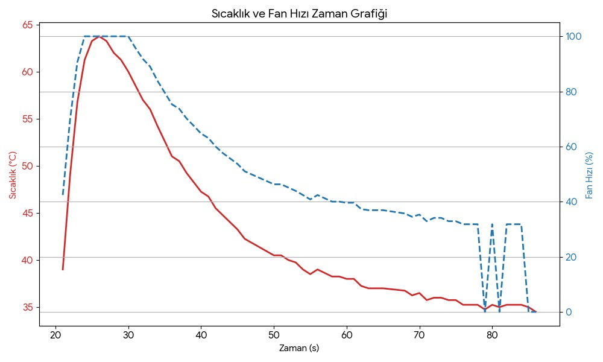

# Aircraft Smart Thermal Brake Management System

**Embedded closed-loop thermal monitoring and cooling prototype — real-time temperature sensing, PWM fan control, multi-protocol peripheral integration, and SD card data logging, inspired by aerospace Brake Temperature Monitoring Systems (BTMS).**

Aircraft brakes absorb extreme kinetic energy during landing and Rejected Takeoff (RTO) events, converting it almost entirely into heat. Unmanaged, this thermal load leads to degraded braking performance, accelerated wear, tire damage, and in worst-case scenarios, fire. This project implements a scaled-down but architecturally faithful prototype of the kind of intelligent thermal management system used across aerospace, EV, and industrial power electronics domains.

---

## System Architecture

The system is a **closed-loop feedback controller**: temperature is sampled continuously, actuation (fan speed) is adjusted proportionally to the measured value, and all system states are simultaneously logged and displayed in real time.



**Communication protocols in use simultaneously:**
- **Software SPI** — MAX6675 thermocouple module on pins 6 (CLK), 7 (CS), 8 (DO) — deliberately isolated from the hardware SPI bus (see Challenges)
- **Hardware SPI** — SD card module on standard SPI pins with pin 4 as chip select
- **I2C** — 16×2 LCD display via I2C backpack module
- **PWM** — fan speed control via MOSFET gate signal from Arduino pin 5

**Control zones (temperature-dependent actuation):**

| Temperature Range | Fan State | Buzzer | Logic |
|---|---|---|---|
| < 35°C | OFF | Silent | Cooling not required |
| 35°C – 60°C | ON, speed ∝ temp | Silent | Proportional PWM ramp (80→255) |
| > 60°C | ON, 100% speed | Silent | Maximum cooling |
| > 65°C | ON, 100% speed | ACTIVE | Overheating alarm |

> **Motor stall prevention:** the PWM ramp floor is set to **80** (not 0) at the 35°C threshold. This ensures the fan has sufficient gate voltage to overcome starting inertia and spin up immediately rather than stalling under a duty cycle too low to generate torque.

**Data log format (written to SD card every second):**
```
time_s,temperature_C,fan_percent
15,42.50,31.4
16,43.00,35.2
17,44.25,40.1
```
Logged CSV is post-processable directly in MATLAB, Python, or Excel — intentionally structured for future PID tuning or predictive maintenance analysis.

---

## Hardware Reality (BOM)

| Component | Qty | Role | Key Specs / Notes |
|---|---|---|---|
| Arduino Uno R3 | 1 | Central controller | All sensing, logic, PWM, and comms |
| MAX6675 thermocouple amplifier | 1 | Temperature signal conditioning | SPI output; cold-junction compensation built-in |
| K-Type thermocouple | 1 | High-temperature sensing | Chosen for wide temperature range; suitable for brake simulation |
| IRF520 MOSFET driver module | 1 | Fan power control | Interfaces Arduino 5V PWM signal to 12V fan supply |
| 12V DC cooling fan | 1 | Forced-air cooling actuator | 12V, 0.10A; speed modulated via PWM |
| 16×2 LCD display (I2C) | 1 | Real-time operator display | Shows temperature, fan status, SD status |
| Active buzzer | 1 | Audible overheating alarm | Triggered when temperature exceeds 65°C |
| SD card module | 1 | Data logging | SPI; requires SDHC-compatible card (≤32GB) |
| MicroSDHC card (32GB) | 1 | Storage media | Selected for Arduino SD library compatibility — see Challenges |
| 12V DC power adapter | 1 | Fan power supply | Powers fan circuit only; Arduino powered separately via USB |
| USB cable | 1 | Arduino power + serial | Isolated from 12V circuit intentionally |
| Jumper wires, breadboard | — | Prototyping interconnects | |

**Libraries used:**
```
SPI.h              — SPI bus (MAX6675 + SD card)
SD.h               — SD card read/write
Wire.h             — I2C bus (LCD)
LiquidCrystal_I2C.h — LCD driver
max6675.h          — Thermocouple amplifier driver
```

**Wiring logic summary:**
- MAX6675 and SD card module share the SPI bus (MOSI/MISO/SCK) but use separate CS pins — the Arduino software drives each CS independently to prevent bus conflicts
- MOSFET gate → Arduino PWM pin; MOSFET drain → fan negative terminal; 12V adapter → fan power; **shared ground between Arduino GND and 12V adapter GND** (see Challenges)
- LCD → Arduino via I2C (SDA/SCL); buzzer → digital output pin

**Close-up wiring — breadboard, IRF520 MOSFET module, and Arduino Uno:**



*IRF520 MOSFET module (red PCB, bottom right) with screw terminals for fan power connection. SPI, I2C, and PWM signal lines routed through the central breadboard.*

---

## Challenges & Debugging

**1. MOSFET operation — control signal vs. power path separation**

Initially unclear how a 5V Arduino output could control a 12V fan without directly powering it.

- **Resolution:** Understood that the MOSFET gate only requires a control signal — the Arduino PWM pin drives the gate, which switches the 12V supply path between the adapter and the fan. The Arduino never carries fan current. Once the signal path vs. power path distinction was clear, the PWM control logic followed directly.

**2. SPI bus collision risk — Software SPI isolation**

Both the MAX6675 and the SD card module use SPI. Placing both on the hardware SPI bus and relying purely on chip-select arbitration risked data corruption during simultaneous or near-simultaneous read/write cycles — particularly given the 1Hz SD logging cycle coinciding with temperature reads.

- **Fix:** The MAX6675 was moved to a **Software SPI** implementation on dedicated pins (CLK → pin 6, CS → pin 7, DO → pin 8), completely decoupled from the hardware SPI bus. The SD card retained hardware SPI with pin 4 as its chip select. This eliminated any possibility of bus contention and resulted in stable, collision-free data acquisition across both devices throughout all test runs.

**3. Common ground requirement**

The MOSFET gate was not switching reliably in early tests.

- **Root cause:** The 12V adapter and Arduino had no shared ground reference, so the MOSFET gate signal had no return path relative to the fan circuit.
- **Fix:** Tied the Arduino GND to the 12V adapter GND. This is a fundamental power electronics requirement — any mixed-voltage system needs a shared voltage reference — and understanding it here directly informed how I now approach multi-rail power distribution in larger systems.

**4. Power supply architecture — avoiding regulator heating**

Initial instinct was to power the Arduino from the 12V adapter via its barrel jack (which would route 12V through the onboard 5V regulator).

- **Decision:** Kept Arduino on USB power and used the 12V adapter exclusively for the fan circuit. This eliminated regulator thermal load and decoupled the two supply rails, improving voltage stability on both.

**5. SD card compatibility — SDHC vs. SDXC**

The Arduino SD library only supports FAT16/FAT32 filesystems, which SDXC cards (>32GB) do not use by default.

- **Fix:** Selected a 32GB microSDHC card, which formats to FAT32 and is fully supported by the Arduino SD library. Choosing the wrong card type here would have caused silent logging failures with no obvious error — the diagnostic path would have been non-trivial without understanding the filesystem constraint.

**6. Fan connector mismatch — JST vs. MOSFET module terminals**

The 12V fan used a JST connector, which is incompatible with the screw terminal on the IRF520 module.

- **Fix:** Identified the wire gauge and connector type, then used direct terminal connection by exposing the wire ends from the JST connector leads to interface with the MOSFET module screw terminals. A small wiring problem, but one that required reading the fan spec and MOSFET module datasheet rather than assuming the connectors would be compatible.

---

## Team & Collaboration

This was a cross-disciplinary group project developed by a team of five: four Aeronautical Engineering students and one Electrical and Electronics Engineering student (myself). The aeronautical team brought domain expertise in brake thermal dynamics, aerospace system requirements, and RTO event analysis. My role as the sole EEE member was to own the entire electronics and embedded systems layer — component selection (MAX6675, IRF520 MOSFET), power rail architecture, SPI bus isolation, PWM control logic, and hardware debugging.

The collaboration reflected how real aerospace embedded projects are structured: domain engineers define the physical requirements, and the electronics/embedded engineer translates those requirements into a working hardware and firmware implementation.

| Contributor | Background | LinkedIn |
|---|---|---|
| Abdoul-Razaq Yussuf Mbalamula | Electrical & Electronics Engineering — electronics design, embedded firmware, hardware debugging | [LinkedIn](https://www.linkedin.com/in/your-profile) |
| Bünyamin Kayacan | Aeronautical Engineering | [LinkedIn](https://www.linkedin.com/in/b%C3%BCnyamin-berker-kayacan-25b867207/) |
| Yusuf Hilmi Kırbaş | Aeronautical Engineering | [LinkedIn](https://www.linkedin.com/in/yusuf-hilmi-k%C4%B1rba%C5%9F-015a592a8/) |
| İhsan Özkan | Aeronautical Engineering | [LinkedIn](https://www.linkedin.com/in/ihsan-%C3%B6zkan-87a7a5253/) |


## Resourcefulness 
This project was built by a cross-disciplinary team without a dedicated electronics lab or technician support. Every hardware decision in the electronics layer — component selection, power rail separation, SPI bus isolation — was driven by reading datasheets and library documentation rather than trial-and-error with components we couldn't easily replace.

Our team was responsible for everything from initial SD library scaffolding and I2C LCD wiring templates to SPI bus initialization code, correctly architecting a dual-SPI-bus setup, diagnosing the common ground failure, and validating sensor readings against expected thermal behaviour across all four control zones. The aeronautical team's input on real brake thermal profiles directly shaped the threshold values (35°C / 60°C / 65°C) — those numbers came from domain knowledge, not arbitrary defaults.

The result was a physically functional prototype that correctly performs all five objectives: real-time sensing, proportional fan control, threshold-triggered alarm, live display, and structured data logging — validated through observed system behaviour rather than simulation.

---

## Results & Logged Output

The system successfully:
- Detected temperature in real time via MAX6675 over SPI
- Modulated fan speed proportionally in the 35–60°C range and held full speed above 60°C
- Triggered audible alarm correctly when crossing the 65°C threshold
- Logged timestamped CSV data to SD card every second without data loss during test runs
- Displayed live temperature, fan status, and SD card status on the LCD simultaneously

**Full system prototype — all components mounted on a single board:**



*Top: Arduino Uno (USB-powered), breadboard, LCD display, SD card module. Centre: K-type thermocouple and MAX6675 module. Bottom: 12V power adapter feeding the fan through the IRF520 MOSFET. The two power rails (USB/12V) are visibly separate, sharing only a common ground node.*

**Measured thermal cycle — temperature and fan speed vs. time:**



*Red solid line: brake temperature (°C, left axis). Blue dashed line: fan speed (%, right axis).*

Key observations from the logged test run:
- **t ≈ 22–25s:** Temperature peaks at ~64°C, crossing the 60°C threshold — fan ramps immediately to 100% and the buzzer alarm activates above 65°C
- **t ≈ 25–80s:** Fan holds at or near 100% as temperature descends through the proportional control zone (60°C → 35°C), with fan speed tracking the temperature drop
- **t ≈ 78–85s:** Temperature reaches the 35°C lower cutoff — fan begins switching off, producing visible oscillation in fan speed as temperature hovers at the threshold boundary

> **Engineering note on the t≈80s oscillation:** The fan cycling on/off rapidly at the lower threshold is a classic **bang-bang instability** at a proportional controller boundary — the system has no hysteresis band around the 35°C cutoff, so small thermal fluctuations cause the fan to toggle. This is a documented limitation: adding a ±2°C hysteresis window (fan OFF below 33°C, fan ON above 35°C) would eliminate it. It's the primary motivation for the PID upgrade in the Roadmap.

**Demo video:** [YouTube Shorts](https://www.youtube.com/shorts/c_0XZ4bGOIs)

**Sample logged data format (CSV, written to SD card every second):**
```
time_s,temperature_C,fan_percent
15,42.50,31.4
16,43.00,35.2
17,44.25,40.1
```

## Representative Code

**Temperature zone control — proportional PWM ramp with hard cutoffs:**
```cpp
void updateFanPWM(float T) {
  if (T <= T_min) {           // Below 35°C: fan off
    fanPWM = 0;
  } 
  else if (T >= T_max) {      // Above 60°C: full speed
    fanPWM = 255;
  } 
  else {                      // 35–60°C: proportional ramp
    fanPWM = map((int)(T * 10),
                 (int)(T_min * 10),
                 (int)(T_max * 10),
                 80, 255);    // minimum PWM of 80 ensures fan actually spins at threshold
  }
  analogWrite(fanPin, fanPWM);
  fanPercent = (fanPWM / 255.0) * 100.0;
}
```
> Note: `T * 10` integer scaling is used because Arduino's `map()` works on integers only — multiplying by 10 preserves one decimal place of resolution without floating-point issues.

**Buzzer alarm — threshold trigger with non-blocking tone:**
```cpp
void updateBuzzer(float T) {
  if (T >= T_alarm) {
    tone(buzzerPin, 2000, 300);  // 2kHz, 300ms pulse
  } else {
    noTone(buzzerPin);
  }
}
```

**SD card logging — write-per-cycle with re-open/close pattern:**
```cpp
void logToSD(float T) {
  if (!sdOK) return;
  File f = SD.open("log.csv", FILE_WRITE);
  if (f) {
    f.print(millis()/1000);
    f.print(",");
    f.print(T, 2);
    f.print(",");
    f.println(fanPercent, 1);
    f.close();   // close after every write — ensures data is flushed to card
  }
}
```
> The file is opened and closed on every write cycle (every second). This is deliberately conservative: it prevents data loss if the system loses power mid-run, at the cost of slightly higher SD bus overhead.

**SD card initialisation with retry logic:**
```cpp
for (int i = 0; i < 3; i++) {
  if (SD.begin(chipSelect)) {
    sdOK = true;
    break;
  }
  delay(300);
}
```

---

## Roadmap / Future Improvements

- **Hysteresis band at lower threshold:** add a ±2°C dead zone around the 35°C cutoff (fan OFF below 33°C, ON above 35°C) to eliminate the threshold oscillation observed at t≈80s in testing — the most immediate and lowest-effort fix
- **Sensor fusion & redundancy:** deploy multiple thermocouples across a simulated brake rotor to measure thermal gradients per zone, with an RPM tachometer wire to verify the fan hasn't stalled — the current single-sensor design is the most significant real-world limitation
- **PID control:** replace the linear PWM ramp with a PID-based controller for more precise thermal regulation and overshoot prevention
- **Fan RPM feedback:** close the fan control loop with tachometer feedback to detect fan failure — currently fan speed is assumed from PWM duty cycle, not measured
- **Fault-tolerant design:** sensor redundancy, fail-safe modes, and fault detection for open-circuit thermocouple
- **Wireless IoT telemetry:** upgrade the MCU to an ESP32 to push live time/temperature/fan data to a Grafana dashboard or cloud endpoint for remote predictive maintenance monitoring — eliminating the SD card retrieval step entirely
- **Predictive maintenance model:** feed historical logged data into a wear model to predict brake service intervals from thermal load accumulation rather than fixed-interval schedules
